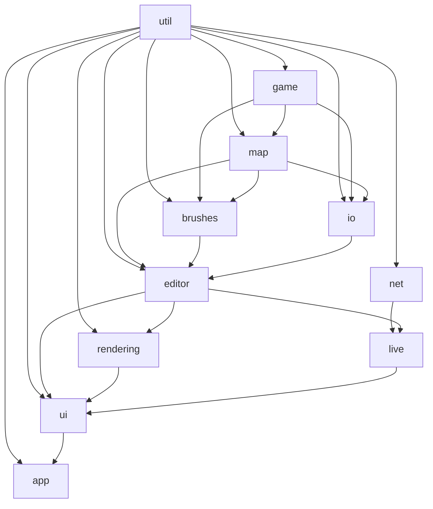

# Architecture  
  
This document describes the modular source layout of Remere's Map Editor after the refactoring.  
  
## Directory Structure  
  
```  
source/  
├── app/            # Application entry point, bootstrap, definitions  
├── brushes/        # All brush types (ground, wall, carpet, doodad, raw, eraser, house, monster, npc, spawn, waypoint, zone, table)  
├── editor/         # Editor core logic (action, selection, copybuffer, settings, editor tabs)  
├── game/           # Game data model (items, monsters, npcs, outfits, tilesets, materials, client assets)  
├── io/             # File I/O (OTBM, OTMM, minimap, sprite appearances, file loading)  
├── live/           # Live collaboration (server, client, sockets, packets)  
├── lua/            # Lua scripting API  
├── map/            # Map data structures (map, tile, town, house, spawn, waypoints, zones)  
├── net/            # Network layer (asio-based connections)  
├── rendering/      # OpenGL rendering (graphics, map display, GL renderer)  
├── templates/      # Template map data  
├── ui/             # wxWidgets UI (windows, dialogs, palettes, toolbars)  
├── util/           # Shared utilities (position, constants, math, threads, common helpers)  
└── protobuf/       # Protocol buffer definitions  
```  
  
## Module Dependency Rules  
  

  
General rules:  
- **util/** has zero internal dependencies (only stdlib and third-party)  
- **game/** depends on util/  
- **map/** depends on util/, game/  
- **brushes/** depends on util/, game/, map/  
- **io/** depends on util/, game/, map/  
- **net/** depends on util/  
- **editor/** depends on util/, game/, map/, brushes/, io/  
- **rendering/** depends on util/, game/, map/, editor/  
- **live/** depends on util/, net/, editor/  
- **ui/** depends on most modules (top of the dependency graph)  
- **app/** depends on ui/, editor/ (application bootstrap)  
  
## Key Design Decisions  
  
### main.h (Precompiled Header)  
`main.h` is the precompiled header. It contains only universally-needed includes:  
- Core wx headers (`wx/wx.h`, `wx/defs.h`, `wx/event.h`, etc.)  
- Standard library containers and streams  
- `fmt`, `pugixml`, `spdlog`  
- Shared utilities (`util/common.h`, `util/const.h`, `util/threads.h`)  
  
Specialized headers (`wx/glcanvas.h`, `wx/grid.h`, `wx/notebook.h`, `nlohmann/json.hpp`, `asio.hpp`, etc.) are included only in the files that use them.  
  
### Unity Build  
The project uses Unity Build by default (`SPEED_UP_BUILD_UNITY=ON`) for faster compilation. All source files must also compile individually (Unity Build OFF) to ensure correct include hygiene.  
  
### Include What You Use (IWYU)  
Every header and source file should include what it directly uses. Do not rely on transitive includes from `main.h` or other headers.  
  
## Tests  
  
Unit tests use GoogleTest. Enable with `-DBUILD_TESTS=ON` (off by default). Test sources live in `tests/` at the project root.  
  
Current test coverage:  
- `Position` — construction, operators, validation, stream I/O  
- `contiguous_vector` — construction, insertion, iteration, clearing  
  
## Adding New Files  
  
1. Place the file in the appropriate module directory under `source/`  
2. Add it to the `SOURCES` list in `source/CMakeLists.txt`  
3. Include only what the file directly uses — do not rely on transitive includes from `main.h`  
4. Verify the file compiles with Unity Build OFF: `cmake -DSPEED_UP_BUILD_UNITY=OFF`  
5. Respect the dependency rules above — e.g., a file in `util/` must not include anything from `ui/`  
